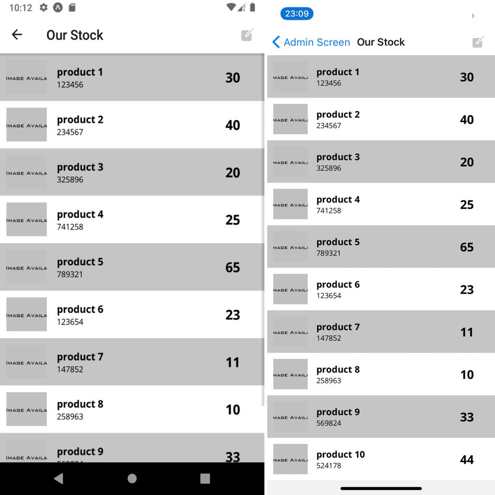

# Inventory App

### Installation

- run `npm install` or `yarn install`

- run `npm install redux@4.1.1` or `yarn add redux@4.1.1`

- run `npm install react-redux@7.2.4` or `yarn add react-redux@7.2.4`

- run `npm install redux-thunk@2.3.0` or `yarn add redux-thunk@2.3.0`

- run `npm install react-navigation@4.4.4` or `yarn add react-navigation@4.4.4`

- run `npm install react-native-maps@0.28.0` or `yarn add react-native-maps@0.28.0`

### Run on Device

- run `yarn android` or `yarn ios` to run on device or emulator

### Project info

I'm working in this project to practice all i learned ,

I'm working for the moment in administration part it will be an Application web with .Net Framework in backend and React.js in frontend

This just a small part of the Full Project 

#### ScreenShots - Native App

